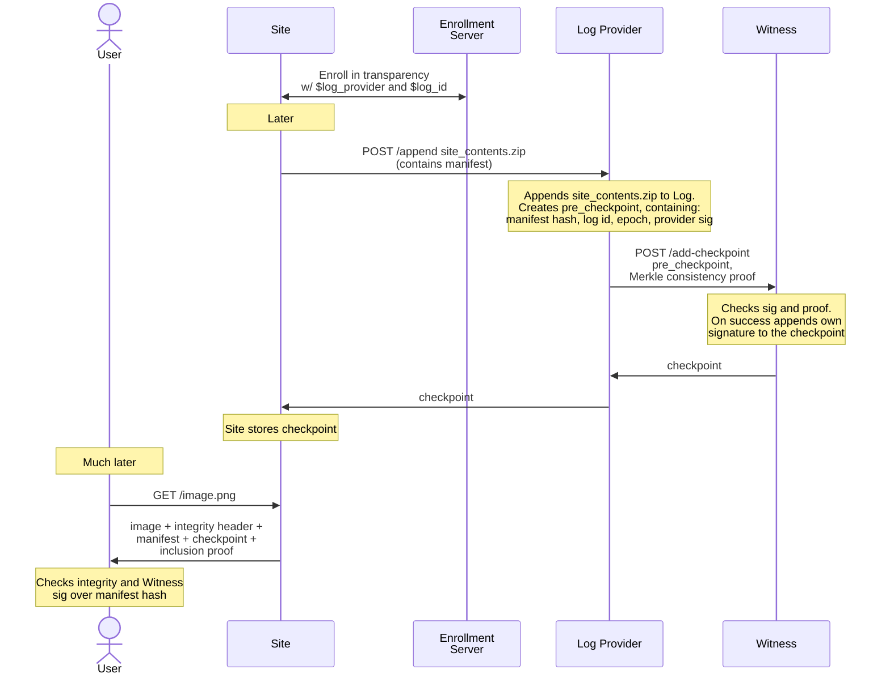

# WAICT Webapp Transparency for the Browser

## Introduction

This document is a supplement to the [WAICT](https://docs.google.com/document/d/16-cvBkWYrKlZHXkWRFvKGEifdcMthUfv-LxIbg6bx2o/edit?tab=t.0#heading=h.hqduv7qhbp3k) specification. It proposes a set of use cases for web application manifest transparency, some protocols that attempt to achieve this, and open problems which need to be resolved.

We note that this document does NOT make any assumption about the structure or functioning of web application manifest integrity. We take as a given that there is a unique 32-byte sequence which uniquely identifies the set of assets that a website cares to protect (in practice, the hash of something(s)).

## Glossary

We use the C2SP glossary for this document. This is an arbitrary choice but we need to pick something.

* A **Site** is a web-based service that exposes some functionality that people want to use. Examples include Facebook or Proton Mail. **A Site is identified by its origin**, i.e., the triple of scheme, domain, and port. An origin is precisely specified in [RFC 6454](https://www.rfc-editor.org/rfc/rfc6454.html).
* A **User** is someone that wants to use a Site. We treat a User and their browser as one in the same in this document.
* The **Enrollment Server** is the service that a Site registers with to announce that they have enabled transparency. There is a single global Enrollment Server.
* The **Log Provider** is the entity that runs a Log. The Log Provider MAY be distinct from the entity that runs the Site. Depending on the Site, the Log Provider may have to store a lot of data, and be expected to have high uptime. **A Log Provider is identified by its domain.**
* A **Log** is a tamper-evident service that stores data in an authenticated, append-only data structure with a succinct representative. For simplicity, we will assume this is a Merkle tree with the representative being the root. A Site MAY use more than one Log at a time. **A Log is identified by the triple of: Log Provider, Site being logged, and revision, a 64-bit unique identifier for disambiguation.**
* An **Actor** is any party that interfaces with a Log. They may also produce signatures of the Log root. There are a few specific kinds of Actors. We give some broad definitions below, but note that Actors can really do whatever.
    * A **Witness** makes sure that a Log’s root is consistent with its previous root. This will usually require (1) authentication, meaning the Log must prove that the root comes from the real Log’s origin (e.g., via a signature using a known public key), and (2) proof of consistency from an old epoch to a new epoch, which is usually a Merkle consistency proof. When convinced of this, a witness will sign the Log’s root.
    * An **Auditor** goes through the Log’s history and verifies some property about it. E.g., a key transparency Auditor might check that each key’s epoch is monotonically increasing over time. An Auditor may also sign the Log’s root.
    * A **Monitor** keeps track of the log and checks properties incrementally, alerting someone if a condition is triggered. For example, the Go sumdb log contains entries of the form `(package-name, version, hash)`. The owner of the `left_pad` package might pay for a logging service to email them whenever a package with the name `left_pad` is published. This way, the package owner will know if their package is being maliciously targeted.

Finally, for this document, we will use **manifest hash** to refer to a 32-byte string that uniquely identifies the manifest being logged. This may be the hash of the manifest file, but we make no such requirement.

## Construction overview



We describe the shape of a web application manifest transparency solution here. The details are very important, and we discuss them at length later on. At a high level:

1. A Site picks a Log Provider, creates a new Log, and enrolls in web transparency via the Enrollment Server.
1. The Site includes in its manifest a hash of each of the assets it wishes to enforce the integrity of.
1. The Site sends the manifest and transparency metadata (and possibly a package of all the files) to the Log Provider.
1. The Log Provider records everything, appends to its Log, and gets the new root signed by a Witness.
1. User's periodically update their list of Sites with transparency enabled, either by polling the Enrollment Server's database or by browser updates.
1. When receiving a manifest from a transparency-enabled site, the User checks the transparency data, ensuring that the origin matches the Site’s, and that the Witness signatures verify.
1. If any checks fail, the User fails closed.

(TODO: Include rough estimates for Log storage requirements (and witness if required))

## Motivating transparency

We give a few scenarios in which a transparency mechanism for webapp manifests would meaningfully improve security or add useful features to the internet ecosystem. These will be our motivating use cases when constructing the protocol.

### Javascript cryptography

#### Tamper evidence for JS payloads

The status quo for trust in in-browser Javascript cryptography is the same as that from 2011, namely that it is [considered harmful](https://web.archive.org/web/20200731144044/https://www.nccgroup.com/us/about-us/newsroom-and-events/blog/2011/august/javascript-cryptography-considered-harmful/). The primary reason comes down to code distribution. Consider WhatsApp as an example. WhatsApp currently hosts a web application which generates cryptographic material in the client’s browser that lets users view their end-to-end encrypted messages. What is to stop WhatsApp from simply modifying their Javascript to exfiltrate those same keys? [The answer for WhatsApp specifically](https://blog.cloudflare.com/cloudflare-verifies-code-whatsapp-web-serves-users/) is “Cloudflare co-signs all Javascript used in the webapp, and clients with a special plugin check the signature before running it.” This ensures that, if WhatsApp launched such an attack on a User with the plugin, it would be evident from Cloudflare’s data. This works fine for WhatsApp, but this is a bespoke solution that is unavailable to anyone but Meta. There are non-E2EE-related JS payloads that benefit from transparency as well, such as verifying code attestation signatures in [private compute](https://tinfoil.sh/blog/2025-02-03-running-private-deepseek).

There is thus good reason to have an open easy-to-join ecosystem which does something similar to "third party co-signs all Javascript used." This would work for any code distribution method, including via the site or a third-party CDN. We can achieve this with webapp manifest transparency. It can open the stage for all kinds of client-side cryptography like Proton Mail, CryptPad, Tinfoil, or a Signal web app.

#### Monitoring tampering

Further, a monitoring service on top of this would help small-scale hosts. An activist org that self-hosts an instance of Cryptpad or NextCloud might be more vulnerable to server compromise than a larger organization with more established practices of upgrading and patching servers. If the self-hosters opt into transparency, they can have a monitoring service email them if the assets their Site is serving ever changes. This would enable very quick detection of compromise in a way that is currently not possible.

### Split-view prevention

Even ignoring cryptographic use cases, there is value in consistency. Quoting from the WAICT spec:

> As Service Providers of security sensitive applications are often contributing to the overall security and privacy of the Internet, they are often considered as high value the target of infrastructure or legal requests that they need to comply with.

This compliance could be done by the Site itself or one of the Site’s CDNs. It is thus desirable to have a mechanism by which users could ensure they are not being served different code/assets from other users.

### Historical records for rotated keys

There are services which authenticate user data, e.g., DKIM signatures on emails or OpenID tokens for authorization. Authentication usually amounts to a signature verification using a public key that can be found at a well-known URL. However, servers running these protocols usually rotate the public keys multiple times a year. It is not clear, then, how one would authenticate a claim regarding an email or token that existed a year ago. It would be nice, then, if there were a log that stored historical public keys.

Webapp manifest transparency is a natural solution in this case. The Site that hosts the public keys would include the well-known URL in their manifest, and include it in the Log. The verifier would check the transparency details before using the public key. Thus the Log contains all the public keys that have ever been used for verification.

Such a deployment would also carry the other benefits of transparency, e.g., being able to detect attacks in real time, and learning rotation rates as a signal for caching policy or possible breaches.

### Other design requirements

We’ll briefly state some more design requirements for any solution we come up with.

1. **Avoiding round trips.**  The mechanisms in place should not cause clients to perform additional synchronous roundtrips. This means that all information needed to exercise integrity and transparency mechanisms should be contained in the initial response from the Site as much as possible.
1. **Preserving privacy.** client doesn’t contact a new third party.  As we need to provide User privacy, no additional party should know anything about the Site being visited compared to what is happening in the current setting. This leads us to think that we should rely on optimized versions of existing  approaches such as Key Transparency and Certificate Transparency. In particular we can use proof of inclusion of the integrity mechanisms into the transparency log instead of fetching live information from a third party.
1. **Ease of opt-in.** The goal of the web integrity effort is to provide integrity, transparency, and consistency guarantees to sites, from those with many million daily active users, to those with a few dozen daily active users. To this end, we aim to keep the barrier of entry for our constructions as low as possible. Some costs are inherent, e.g., interfacing with the transparency ecosystem and general hosting needs, but we aim to isolate these as much as they can be isolated, and eliminate them where possible.
1. **Ease of opt-out.** It should be possible for a Site to create a new Log, switch Log Providers, or stop participating in transparency altogether. Further, it should be possible for this to happen even if all cryptographic material is lost, or the Site is seized. What we don’t want is a permanent lockout condition  for certain domains, as was permitted in the failed HTTP key pinning spec. This is a difficult needle to thread: any solution must be powerful enough to provide strong guarantees to a User, but optional enough that it can be disabled at any time.

## Construction

### Signaling transparency to the User

To enable transparency, a Site must register with the Enrollment Server, giving it the Site's desired Log. Each User is responsible for maintaining a reasonably up-to-date copy of the list of enrolled Sites (this can be done, e.g., by browser bundling and/or periodic polling).

Specifically, the information that must be conveyed to a user is a mapping of Site origin to a list of Logs. The specific format of this is out of scope. Additional information MAY be included in the entries of the mapping, such as a list of authorized signers for manifests presented by the Site.

#### Initiating enrollment

To enroll, the Site must provide its desired Logs and prove that it is indeed the Site. To facilitate this , the Enrollment Server exposes a single POST endpoint, at `https://$enrollment_server/set-site-logs` (TODO: add some flexibility here, maybe `<submission prefix>/waict/v1/set-site-logs`, like [static-ct does](https://github.com/C2SP/C2SP/blob/main/static-ct-api.md#parameters)). A request to this endpoint is of the following form:
```javascript
POST /set-site-logs
Content-Type: application/json

{
    "version": 1,
    "site": $site_origin,
    "logs": [
        {
            "log_provider": $log_provider,
            "revision": $revision
        },
        ...
    ]
}
```
where `$site_origin` is the origin of the enrolling Site, serialized as in [RFC 6454, section 6.1](https://www.rfc-editor.org/rfc/rfc6454.html#section-6.1) (i.e., `scheme://domain:port` form), and each `$log_provider` is a domain of a Log Provider, with syntax conforming to [RFC 1035](https://www.rfc-editor.org/rfc/rfc1035#section-2.3.1), and each `$revision` is an 8-byte bytestring, encoded in base64. The Enrollment Server interprets each entry in `logs` as the Log defined by `($log_provider, $site_origin, $revision)`. To unenroll from transparency, the Site simply leaves `logs` empty. The JSON object MAY contain additonal fields, whose interpretation is left to the Enrollment Server implementation.

If the request is well-formed, the Enrollment Server responds with a _challenge_ string. This string MUST have at least 128 bits of entropy, MUST NOT contain any characters outside the base64url alphabet, and MUST NOT include the base64 padding character ("=").
```
HTTP/1.1 200 OK
Content-Type: plain/text

DrqKo-kHVw2FZURaLWayeyir5yiOaUVqZjboTmVbG1I
```

#### Completing enrollment

(TODO: be more specific about response codes and content types. See eg the [ACME spec](https://www.rfc-editor.org/rfc/rfc8555.html#section-8.3))

Upon receiving the challenge from the Enrollment Server, the Site copies it and exposes it at the well-known path (see [RFC 8615](https://www.rfc-editor.org/rfc/rfc8615.html)) `$site_origin/.well-known/waict-enrollment-challenge` (TODO: Register this well-known path with IANA). The Enrollment Server polls this endpoint with `GET` requests until some timeout period. If it receives the same challenge string in response, the Enrollment Server updates its database to have the `$site_origin` map to the list of provided Logs.
(TODO: This diverges from the ACME challenge-response protocol in two ways. First, the Enrollment Server checks ownership by checking a response value from the Site rather than checking that a specific path returned a 200. Does this matter if we don't care to support concurrent enrollments? Second, there's no public key cryptography here, because there are no account keys. Do we want account keys like ACME?)

The Enrollment Server MAY impose additional rules on its enrollment process. For example, the Enrollment Server may offer email notifications for Site owners. Thus, it may have a rule that if a Site is unenrolling and has not signed up for email notifications, the Site must wait for a three-hour "cooldown" period before the unenrollment goes into effect. Such rules are left out of scope.

A note on concurrency: in practice, a Site should not have a reason to enroll multiple times in short succession. If it does, though, the Enrollment Server may interleave events arbitrarily within its timeout window. That is, if a Site enrolls with request A, then enrolls with request B, then exposes the challenge for A, then exposes the challenge for B, the Enrollment Server may update its database to map the Site to the Logs in request A or request B, or none.

#### Transparency of the Enrollment Server

To achieve the goals of this specification, it is necessary that the act of disabling web application transparency itself be transparent, i.e., that the action is recorded in a log somewhere.  Further, it is necessary to that the act of forking the view of a Site's assets by using different Logs for different Users be transparent as well.

To this end, the Enrollment Server MUST make its database transparent. We leave the specifics of this mechanism out of scope.

### Transparency metadata formats

We describe the structure of the transparency metadata that a Site presents to a User

#### WAICT transparency bundle (tbundle)

When the Site serves its manifest, it will also serve a **tbundle**—which attests to the fact that the manifest is the latest in a Log and that one or more Witnesses have observed the Log's last update. The tbundle contains an **inclusion proof**, encoding the first fact, and a **checkpoint**, encoding the second fact. It MUST be served, either embedded within a page or in a separate request, with the MIME type `application/waict-tbundle-v1`. The tbundle is of the form:
```javascript
{
    "checkpoint": <b64>,
    "inclusion": <b64>,
    ...
}
```
where `checkpoint` contains the base64 encoding of the checkpoint (described below), and `inclusion` contains a base64 encoding of an [RFC 6962](https://www.rfc-editor.org/rfc/rfc6962.html#section-2.1.1) Merkle inclusion proof, proving that the manifest hash is the last leaf in the tree whose root appears in `checkpoint`. The tbundle MAY include other data in the object, so long as its keys do not conflict with the keys above.

#### Checkpoint

The checkpoint value in the tbundle is the base64 encoding of a [tlog checkpoint](https://github.com/C2SP/C2SP/blob/main/tlog-checkpoint.md). The lines are as follows:
1. Contains the `$log_provider/waict-v1.$site_origin.$revision` where `$log_provider` is the domain of the Log Provider, `$site_origin` is the base64 encoding of the Site origin `$scheme://$domain:$port`, and `$revision` is the base64-encoded revision string.
1. Contains the decimal-encoded size of the Log Merkle tree.
1. Contains the base64 encoding of the Log Merkle tree root.
1. An extension line that contains `"not_after "` followed by the decimal-encoded Unix timestamp in seconds for the end of the validity period of this checkpoint.
1. Empty
1. All lines from here on are signature lines. They either have the key name of a Log Provider's or a Witness' public key.

An example checkpoint is as follows:
```
eu.loggy.com/waict-v1.aHR0cHM6Ly9teXNpdGUuZXhhbXBsZS5jby51azo0NDM=.4f+RttBZgSA=
20852163
CsUYapGGPo4dkMgIAUqom/Xajj7h2fB2MPA3j2jxq2I=
not_after 1738603576

— loggy.com/mypubkey1 Az3grlgtzPICa5OS8npVmf1Myq/5IZniMp+ZJurmRDeOoRDe4URYN7u5/Zhcyv2q1gGzGku9nTo+zyWE+xeMcTOAYQ8=
- trustedwitness/pubkey-39082034 enF8/MTPl4MBSsAHoqpaHf2iiI98t0VeCsfFYxHmkSx6OdWcB4u5SQPaSUBrPqKoms0NJ4sYB3nc6zP3BIqyrMMUTUY=
```

### Tbundle verification

Depending on the enforcement mode, a User cannot execute or render anything until the inclusion of the asset's hash is checked in the manifest, and the manifest hash has been validated. We detail these steps below. If any of these fail the browser MUST pause page load and notify the user. The User MUST:

1. Decode the `checkpoint` field of the tbundle and parse it as a tlog checkpoint.
1. Load the entry in the Enrollment Server's database corresponding to this Site. This is a list of Logs, defined by their `($log_provider, $site, $revision)` triple.
1. Ensure the Site's origin matches the `$site` in each of the Logs in the database entry.
1. Ensure that the Log defined in the first checkpoint line matches at least one of the Logs in the database entry.
1. Ensure that the current time is not after the `not_after` timestamp in the checkpoint.
1. Ensure a sufficient number of witness signatures verify. It is RECOMMENDED that this threshold be at least 2.
1. Ensure that the inclusion proof verifies with respect to the tree root and size in the checkpoint, and the manifest hash.

#### Only verify Witness signatures

A User SHOULD NOT verify any signatures whose key name is not that of a known Witness. There is no reason to do so, as it does not add security. Further, a User cannot verify the signature of a Log Provider without its public key, which may rotate arbitrarily. Since one of our goals is to minimize round-trips, we cannot expect a client to fetch this on every verification. Further, if the public key is stored in a cache, a malicious Site colluding with a Log Provider can manipulate the public value to fingerprint users. This violates our goal of preserving privacy.

#### Witness trust ecosystem

Witness signatures have a unique Witness key name included, and may rely on a trust ecosystem involving browser vendors and Witnesses, similar to that of the Certification Authority trust ecosystem. This ecosystem is essential to the functioning of the system described in this spec, but we leave the details out of scope.

### Witness signing Logs

Witnesses MUST follow the [tlog Witness API](https://github.com/C2SP/C2SP/blob/8991f70ddf8a11de3a68d5a081e7be27e59d87c8/tlog-witness.md), which defines how Logs get updates signed.

### Log Provider endpoints

A Log Provider MUST expose the following HTTP API. We let `$base` denote the domain of the Log Provider, as appears in the Enrollment Server mapping and the checkpoint. We draw largely from the [`static-ct`](https://github.com/C2SP/C2SP/blob/main/static-ct-api.md#merkle-tree) and [Go `sumdb`](https://go.dev/ref/mod#checksum-database) APIs.

| Endpoint | Description |
|-|-|
| `GET $base/latest?site=$site&rev=$revision` | Returns the latest checkpoint for the Log defined by `($base, $site, $revision)`. Where `$site` is serialized Site origin (in `scheme://domain:port` form), `$revision` is the 8-byte revision string, and both are URL-encoded ([RFC 3986](https://www.rfc-editor.org/rfc/rfc3986.html).

Logs MUST serve a checkpoint whose `not_after` has not elapsed. |
| `GET $base/tile/$H/$L/$K[.p/$W]` | Returns a Log tile, which is a set of hashes that make up a section of the Log. Each tile is defined in a two-dimensional coordinate at tile level `$L`, `$K`th from the left, with a tile height of `$H`. The optional `.p/$W` suffix indicates a partial log tile with only `$W` hashes. Callers must fall back to fetching the full tile if a partial tile is not found. |
| `GET $base/tile/$H/data/$K[.p/$W]` | Returns the manifest data for the leaf hashes in `/tile/$H/0/$K[.p/$W]` (with a literal data path element). |
| `POST $base/append?site=$site&rev=$rev [binary body]` | Appends the given binary blob to the Log defined by `($base, $site, $revision)` as above. Returns a checkpoint signed by a quorum number of Witnesses. The Log Provider MAY inspect the blob to check for well-formedness. (TODO: We don’t define quorum number or the format the blob has to be in) |

(TODO: Must define a GET endpoint to expose public keys that can be used to authenticate to a Witness. See [open problem](https://gist.github.com/#log-providers-pubkey-specification-rotation--format-isnt-defined).)

### Monitoring a Site

A web application integrity Monitor should be able to provide alerts whenever important events occur regarding the Site. In particular, for any Site, a Monitor:

1. Should be able to detect whenever the Site’s associated Logs change
1. Should be able to detect whenever a new manifest was added to any of the Site’s Logs

We describe how both of these are achieved.

#### Detecting change of Log

Since the Site’s Log(s) info is encoded in the Enrollment Server's database, and the database itself is made transparent, it suffices to scan the database log for entries pertaining to the Site.

#### Detecting new entries in Log(s)

Now that the Monitor has a definitive list of Logs for the Site, it can tail these Logs for updates. Further, since Log Providers SHOULD have a freshness policy, this puts a limit on how much time it takes to detect the issuance of a new manifest.

### Handling failures

We discuss some failure modes and how the above construction proposes they be handled.

#### Log Provider failure

If a Log Provider is down, a Site cannot make updates. Even worse, after the `not_after` time on the latest checkpoint, the Site will effectively go down even if there are no updates. When this happens, the Site can sign up with a new Log and re-enroll at the Enrollment Server with it. Another alternative is to unenroll from transparency entirely.

#### Witness failure

If a single Witness is down, a Log Provider can simply request another Witness to sign their checkpoint. If the majority of Witnesses are down, the same issues as above occur. When this happens, enrolling in a new Log doesn’t help the Site, since the new Log Provider still won’t be able to get a sufficient number of signatures on the checkpoint. The only option the Site has is to unenroll from transparency.

## Example workflow: A Site enrolling in transparency

Alice is the owner of `alicexpress.com`. As someone who cares a lot about providing a consistent user experience for her customers, she has already enabled web application manifest integrity on her site. But she would like to go one step further and make sure that, if her server is ever hacked and starts changing what her clients see, she’ll know about it.

#### Enrolling in a Log Provider

First, Alice will pick her Log Provider. There is a large ecosystem of Log Providers, so she goes with one she’s heard good things about, Loggy. She sets up a Loggy account and selects the amount of storage she plans on using. Once her account is set up and she has downloaded an API key, she will create a new log on Loggy. She gives her full origin, `https://alicexpress.com:443`, and selects a random revision string, and clicks Submit.

> [!NOTE]
> Notice that Alice does not have to prove she owns alicexpress.com. To explain why, suppose Bob were registering a log for alicexpress.com. Then Bob’s account’s revision string would be unrelated to the revision string used on the actual site (Loggy would not allow two people to use the same revision on the same Site). Thus, the Log he creates is distinct from Alice’s, and no Log hijacking occurs.

#### Making a Log entry

Now Alice can start embedding transparency data in her site. She configures her site build tool to call out to the `waictlog` binary. Given the site URL and a set of file paths, this tool will compute the files’ hashes, pick an expiry period, create a zip of all the files, and send everything to the Loggy API. On success, the API returns the checkpoint with signatures from multiple witnesses. Finally `waictlog` verifies the checkpoint has the correct Site, Log Provider, and revision, and will check the inclusion proof with respect to the leaf hash that it knows. If all succeeds, `waictlog` outputs the checkpoint.

The build tool then embeds the file in the website. Alice can verify that all the transparency data is validating correctly by running her build with respect to `staging.alicexpress.com`, and using her browser’s dev tools.

#### Enrolling in monitoring

Since the entire purpose of this is to get alerts if her site is ever hacked, Alice needs to set up monitoring for herself. Again, there is a large ecosystem of monitors, so she picks one she’s heard of: Monity. She makes an account and creates a new alert for `alicexpress.com`. Any time a deployment occurs, she wants to receive an email with NOTICE in the subject line. And any time the transparency status of her site changes, i.e., addition/removal of Log Providers, or change of any revision numbers, or removal of transparency entirely, she wants to receive an email with URGENT in the subject line and have it sent to her personal email as well.

#### Enabling transparency

Finally, Alice is ready to flip the switch. In order for her users to start using transparency, she needs to enroll with the Enrollment Server, indicating to it that she’s using Loggy and has a specific revision number. She performs the build for production, deploys, and checks that transparency is validating in her dev tools. She then runs `enrollify`, a `certbot`-like CLI. This will look for the transparency data in her site root and use the first Log it finds (Alice could specify these manually, and even include multiple Logs, but she has no need). It embeds the Log Provider and revision information in its POST request to the Enrollment Server, and updates the sites `/.well-known/waict-enrollment-challenge` endpoint accordingly. Once this protocol terminates, Alice is all done.

Alice receives an URGENT email from her monitor, saying that transparency has been enabled. She breathes a sigh of relief. Finally, she can return to her passion of drop-shipping polyester clothing.

(TODO: Write up how attacks would be detected. Site’s forking via different Logs, Logs forking via different Witnesses, etc.)

## Open problems

There are many details of this protocol that we have not yet finalized, and some open problems that we have not yet solved. We list some below.

### Rollback can happen within validity periods

Currently, a Site could serve any sequence of checkpoints to a User over time, so long as they all have a not_after timestamp that’s in the future. This might be too much leeway for a malicious Site. It might be valuable to have **Users record the last tree size** and refuse any checkpoint with a smaller size. This has the downside of requiring users to maintain an integer for every site they visit with transparency enabled.

### Where does versioning go?

Currently, the version string in our checkpoint defines the protocol version for the entire checkpoint. **This forces every Witness to use the same version.** If some Witnesses are slow to upgrade, this might be an issue. This might be a non-issue, since we don’t expect there to be many Witnesses, and they can all expose 2 signing endpoints during transition. So at some point, it should be possible to go from all-v1 to all-v2 without any downtime.

In addition, we have `.well-known` endpoints without versions, and the version of the Enrollment Server request being encoded in JSON rather than the MIME type. This doesn't feel super cohesive.

### Checkpoint location is undefined

It’s not clear where the website should put its checkpoint data for the User to verify. This can be in a CSP header, maybe.

### Forking a Log by picking different Witnesses

Suppose a User only requires one Witness signature to validate the checkpoint. Then a malicious Log Provider may fork their log into two. They have fork #1 co-signed by Witness W1, and fork #2 co-signed by Witness W2. Users and Witnesses may not be able to detect this fork.

Two possible solutions are:

1. **Making Witnesses queryable.** We define an API by which Witnesses can be queried on the Logs they’ve signed. Monitors can be assumed to have the most recent part of Logs, as well as the frontier of the Merkle tree, so this is efficiently verifiable. The downside here is this is potentially a lot of work for Witnesses (which are assumed to be pretty lightweight services) to do.
1. **Requiring a strict majority on checkpoints.** If there were 10 Witnesses in the trust database, and Users required 6 of them to appear on any checkpoint, then forking would be impossible. One downside to this is that every extra signature will add latency to a deploy pipeline (not sure how much though). One option, discussed in [tlog checkpoint spec](https://github.com/C2SP/C2SP/blob/8991f70ddf8a11de3a68d5a081e7be27e59d87c8/tlog-witness.md#tbd-monitor-retrieval-mechanism), might be to relax this requirement for the Users: Users could accept 3/10 Witnesses on a checkpoint, but Monitors would require 6/10. This is kinda clever. if a Monitor sees a checkpoint with 6/10 signatures, then a fork could not have occurred then or before. So any User who used that checkpoint or before is safe, even if they didn’t get a strict majority.

### The role of detectability

Suppose we could catch all types of forking. For completeness, here are two more:

1. A Site could fork the view of their assets by simply using two different Log Providers, getting two different checkpoints, and presenting one or the other to a User.
1. Even more simply, a Site could fork the view of their assets by using two different revision numbers for their two views.

Currently, these two can be detected by monitoring CT logs, since Log Provider and revision data are stored in the TLS leaf cert. 

**The question is whether the mere detection of forks is sufficient.** There is no formalized notion of trust in Log Providers. So if a Log Provider is found to be acting maliciously, will this result in a sufficiently strong social pushback against the Log Provider and all the Sites that use it? Honest Sites can hedge against malicious Log Providers by using more than one. Of course, they are not free, so this costs more.

Another question is **how much can the checkpoints in different Logs for the same Site differ before it’s called a fork?** It would be bad to say that two distinct checkpoints cannot have any overlap in validity, because this offers no transition periods to sites with caching. So should we just say it’s okay as long as one is a prefix of the other? I suppose this is fine, since Monitors are assumed to have the data to check this.

### Log that stops serving data

Related to the trust issue, it is not clear how the ecosystem should handle a Log that stops responding to data requests. A non-functioning Log means an unaccountable Site. Again, third parties can detect this by simply querying the Log. Is this enough?

Further a Log might even stop providing the checkpoints it is serving to its reliant Site. It may be valuable for third parties to have access to these checkpoints, though, and you can't just asked eg an Armored Witness for their latest checkpoint because they don't store them. One solution might be to **rely on [distributors](https://github.com/transparency-dev/distributor?tab=readme-ov-file#distributor) for up-to-date checkpoint data**.

### Log Providers can insert data the Site never asked for

Currently, there is nothing preventing a Log Provider from inserting data into a Log that the Site never asked it to insert. In these cases, it would be impossible for the Site to prove to a third party that they didn’t request this. This seems like a pretty inherent problem. I’m not sure we can/want to handle this.

### Log Provider’s pubkey specification rotation + format isn’t defined

We do not currently have a way for a Witness to authenticate Logs. In the current tlog ecosystem, this is done manually, since it’s quite small. One idea to scale this is to require logs to make a public key available at its `origin/.well-known/waict-pubkeys`. Tracking issue [here](https://github.com/C2SP/C2SP/issues/115). Also we might want the pubkey endpoint to adhere to HPKE Key Directory over HTTP.

## Changelog

### Unreleased

**Switched from TLS cert-based enrollment to an Enrollment Server system.**
We now require the existence of a global Enrollment Server for all Sites, like [WEBCAT](https://securedrop.org/news/introducing-webcat-web-based-code-assurance-and-transparency/). This shift was for a few reasons:

1. "Transparency mechanism for WAICT enrollment" is really not what CT was intended to be used for.
1. You can enforce more transport mechanisms. The CT-based one requires a Site to have TLS. But now that enrollment is an interactive protocol, it can use whatever transport the Enrollment Server supports, e.g., Tor.
1. You can enforce cooloff periods. The Enrollment Server can have a policy like "if you don't have an email registered for notifications, you have to wait 3 hours between requesting unenrollment and us updating the database." This can slow down attacks, or else force them to be more overt by adding a malicious payload to the Log.
1. The enrollment is more extensible so you can embed information in the future without writing a brand new TLS cert extension and getting it approved. One way you might extend it is to include a list of developers (via, e.g., their OIDC identities) who MUST sign a manifest before the User should run it. This is what WEBCAT does.

**Defined a concrete format for the tbundle.**
We previously punted on the specific format of the transparency (meta)data structure, and what precisely the Witness was signing. We are now using the tlog checkpoint format, and including it in a JSON object. This lets us piggyback on the tlog ecosystem of specs and deployments.

### Draft 4

**Added subsection on Monitors.** We now describe what a Monitor is expected to do and how it does it.

**Clarified Log ID.** The glossary now says a Log Provider is identified by domain, a Site is identified by origin, and a Log is identified by (provider, site, revision).

**Separated inclusion proof from checkpoint.** Previously, the inclusion proof was part of the checkpoint. This is not in keeping with the C2SP definition of checkpoint. Also, when a Log Provider serves its latest checkpoint, it should not need to also have an inclusion proof. So we separated the two notions.
**Validity is not part of the leaf.** Previously, we hashed in the not-after metadata into the leaf hash. Since Log Providers cannot serve stale checkpoints, this means they have to re-request a new Log entry whenever refreshing the latest checkpoint. But recall that the Witness API permits signing requests for trees that have not changed. So if we just move the validity period to signed metadata, we allow Log Providers to do updates without extending their Log.

### Draft 3
**Removed specification for how Witnesses authenticate Log Providers.** I think picking a URL schema and pubkey + rotation metadata format is premature. We can leave these undefined for now.

**Removed Witness querying API.** The entire point of a Witness ecosystem is to have high-trust, low-overhead machines that will sign things for you. By making them have to respond to queries, we drastically increase the difficulty of deployment. To get around the forking issues that we previously used querying to resolve, we embed more info in the TLS leaf certificate, and propose (in Open Problems) to require a strict majority of Witnesses in order for Monitors to accept a checkpoint.

**Removed tlog-style checkpoint format.** We previously said the format was loose anyway, and it became cumbersome to represent things in the tlog style. In particular, since not_after cannot be included in the first line (since this is supposed to be a unique Log identifier), it was necessary to define a second data structure which contains metadata that’s hashed into the final leaf hash. I think it makes most sense to just show this all in one data structure and define how hashes and signatures are computed. Thus, we introduced committed_metadata and t_hash.

**Added timestamp to signature.** This was just because that’s what tlog does. I’m not certain we need it, but it seems like something we might regret not having. I don’t feel strongly.

### Draft 2
**Signaling transparency in TLS.** Previously, the User responded to a logged→not logged transition by deleting local storage. The reason is, previously, if a Site were compromised and served non-logged code, there would be no record of this. So a User, to protect themselves, must take security measures such as deleting local context. However, this has the disadvantage of being kinda arbitrary, leading to poor UX, and being narrowly focused on webapps that do e2ee messaging.

**Now we have this transition logged in CT, and place no constraint on the User’s behavior.** This feels more correct.

**Removing User state.** Rather than checking that the tree size has not decreased since the last load, the User checks that the not-after field in the checkpoint is not in the future. This is for two reasons. First, it means the User no longer has to store any per-site state anymore. Secondly, and relatedly, it permits the User to ensure that they are not looking at an old version, even on first page load.

**Fork-detection by querying Witnesses.** This draft includes a section on auditing Witnesses, i.e., having Witnesses expose an API to make queries on the set of every checkpoint they’ve ever signed. This partially solves the problem of detecting forking, but it remains an open problem whether detection is sufficient, and whether this is too much burden on Witnesses.
